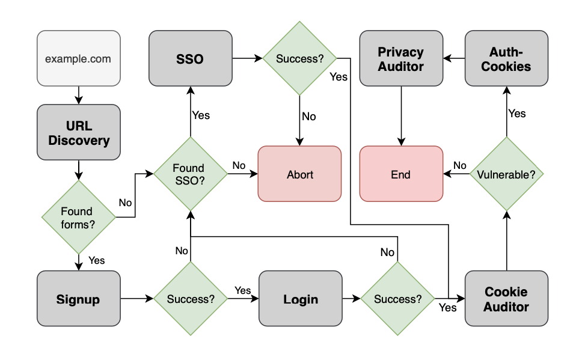
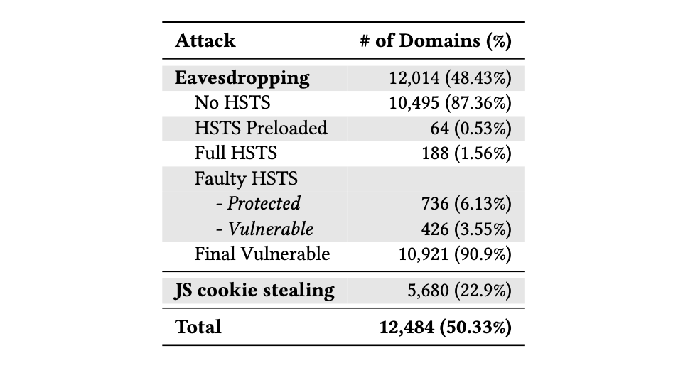
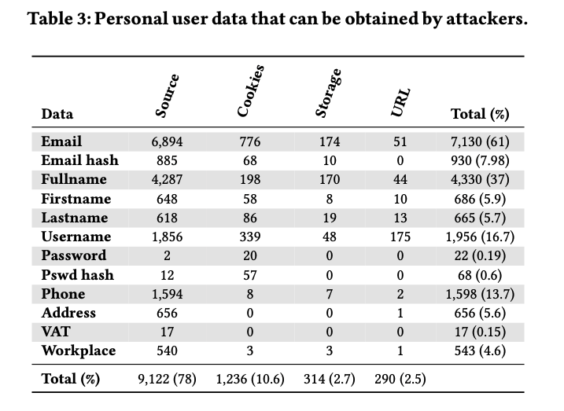
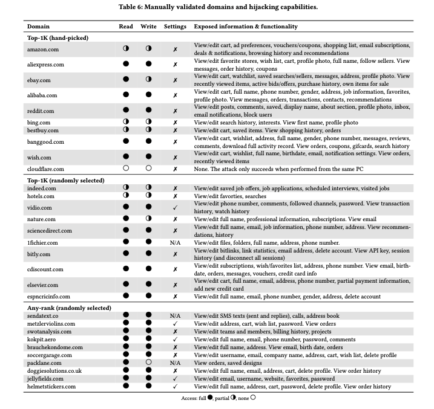
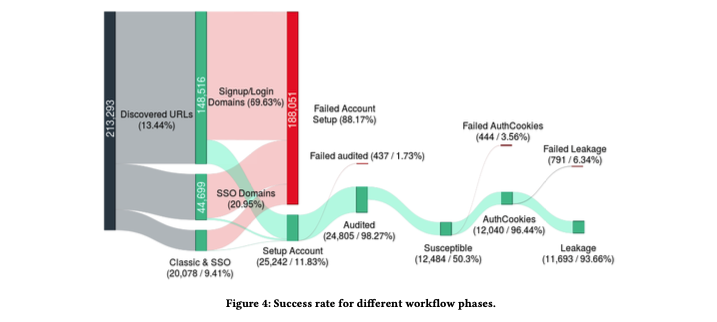

## Paper Info
- **Paper Name**: The Cookie Hunter: Automated Black-box Auditing for Web Authentication and Authorization Flaws
- **Conference**: CCS '20
- **Author List**: Kostas Drakonakis, Sotiris Ioannidis, Jason Polakis
- **Link to Paper**: [here](https://www.cs.uic.edu/~polakis/classes/CS568/fall-2020/cookiehijacker-ccs20.pdf)
- **Food**: Brownies

## Prerequisites

Authentication is the process of confirming that a user entering credentials is who they claim to be.  This could be tested by entering a password only known to the user, biometrics, or the verification of an object which only the user has.  Authorization is the process of providing a set of permissions to that particular user to enable them to perform various activities.

## Authentication & Authorization Sequence

Every time a user completes a request to sign on to a website, the server establishes a connection and sends a cookie to the client to be used to maintain the connection.  While security flaws exist in authentication/authorization modules, implementation of session cookies is also often less than perfect. There are numerous known malicious attacks on session cookies.  The typical procedure to exploit session cookies requires us to start with a valid session cookie for a particular website, and because these session cookies are highly customized, it is nearly impossible to scan multiple websites for session cookie exploits at scale without having to do a massive amount of work in order to create user accounts on every website you wish to scan. 

To scan a massive number of websites for cookie related security vulnerabilities, we must first create an automated system that will be capable of creating accounts and obtaining session cookies from websites with very different user interfaces, different code bases, running on different platforms.  Once these valid sessions are obtained, we can then run automated scans to determine how many common vulnerabilities can be applied to a particular website and perform the same repetitive tasks to thousands of other websites as well.

## Cookie Hijacking

Stateful websites implement sessions with an authn & authz sequence. Most websites establish this connection or session using a cookie. The client can use that cookie to avoid running through the authentication and authorization procedure for every privileged action they take on the website. This conceptual model has worked well for most websites. Still, an obvious security concern is the secure transmission of the session cookie since the successful hijacking or impersonation of a session cookie will allow you to achieve a privileged connection to a website without the authentication and authorization procedure.

## Motivations for Cookie Hijacking

Some motivations include:

- The relative ease of establishing a man in the middle attacks on the Internet when compared to more physically secure systems
- The high-value of achieving private connections on certain websites, not limited to simply corporate, financial, or personal data
- The large attack surface, consisting of millions of websites

Defenders have many auditing challenges:
- Massive codebases and these codebases are very dynamic as new features are rushed out continually on certain sites
- Combinations of many different technologies often requiring different specialists on other teams to coordinate their efforts
- Massive codebases also imply large quantities of legacy code, often requiring outdated server technologies

**Any industry-wide solution** to evaluate these security issues must have the capability of handling the following characteristics:

- Automation due to the millions of websites to evaluate
- Interactions with very complicated large scale systems
- Universally applicable actions capable of handling a wide variety of technologies, elements, and presentation styles
- The  capability to deal with the obfuscation/minification widely implemented on visible code such as JavaScript when scanning that code for vulnerabilities

## Methodology

Cookie Hunter attempts to handle this challenge by implementing a custom browser automation tool built on selenium, analyze various websites using this tool, handle the unique account creation process, and then analyze the website against several forms of cookie hijacking.  The previous state-of-the-art solution was only able to handle roughly 100 websites. Cookie Hunter can operate on a significantly larger number of sites.

The threat model used in this analysis’s final stage is of a passive network attacker or eavesdropper. The visible website JavaScript is analyzed for exploits in the code.

### System Design:

1. LIST OF DOMAINS: Start with the 1 million most popular website domains in the Alexa database. Because this list changes frequently, 1.5 million websites were gathered.
2. URL DISCOVERY: Grab all hyperlinks and crawl two levels deep in the website
3. FIND FORMS: Find all websites that web crawling can extract registration and login links (roughly 200,000) (foreign websites translated to English first)
4. SIGN-UP: Attempt to use an automated tool to sign up to the website and guess the password requirements. For ethical reasons, websites requesting phone numbers or presenting captchas are not processed.  This limits the available domains significantly.
5. Attempt to click on all buttons on the register page, enter a valid email address and other information.  To determine if this was successful, check and see if the registration button disappears, possibly a sign-out button appears, and a registration email was received. Roughly 25,000 websites were successfully registered.
6. SSO: If no forms are found, attempt SSO registration using Google and Facebook

### Vulnerability Discovery 

Once logged-in, sites were audited common cookie and privacy vulnerabilities. 

- **Cookie Auditor**: Checking for cookies that are neither secure nor HTTPS only.
- **Auth-Cookies**: Determining which subset of cookies are used for authentication/authorization by incrementally disabling one cookie at a time. If you are still able to sign on with it disabled, that cookie is eliminated as unnecessary. Additional processing is then performed to minimize this further.
- **Privacy Auditor**: With access to these cookies, the automated tool also determines if eavesdropping could be performed and what information can be stolen from the user session by checking the website for private user information.

## Evaluation and Observations 

Of the 1 million sites tested, only around 25k were successful in logging-in an pentesting the site.
Of the 25k, around 12k were vulnerable to the earlier mentioned tests. This is best described in their table:

### Observations

- Popular websites are often more vulnerable than less popular websites.  This number may be slightly skewed because popular websites often are more likely to have login forms and larger code bases.

- Many websites implemented HSTS incorrectly, leaving either the base domain unprotected or not including subdomains.

Note that not all 5680 domains are vulnerable to XSS because protections may be deployed that are not easily visible or detectable.

### Manual Validation & Case Study

To verify the automatic tool’s results, a validation test to confirm the capacity to hijack a number of these domains were performed.  Out of the top 1000 sites, 10 domains were picked randomly from the data set, 10 domains picked randomly out of the remaining data set, and 10 domains were handpicked.
21 out of the 30 domains were successfully hijacked, obtaining full control, and 8 of the remaining domains were successfully hijacked partially. It was possible to perform password changes for 5 of these domains.

## Discussion 

An interesting insight is that cookie security implemented through HSTS is challenging to do properly. Countless implementations exhibited major security flaws. 

So what is an acceptable reduction from a dataset?  Is it significant that the demonstration software was only successful in registering accounts on only 25,242 domains out of 1 million?  

This is significant for 2 principal reasons. Mainly because the previous state-of-the-art solution was only able to analyze 100 websites, a 2-order of magnitude increase is substantial.  (Typically an increase of 1 order of magnitude over the state-of-the-art would not be significant.)  Another major contribution of this paper is the automated analysis that has not been done before.

A common weakness of many papers such as this one is that although many numbers are presented, the significance of these numerical results were not developed as thoroughly as they could have.

Account creation might have been significantly more successful if they could use phone numbers and captchas.  An important thing to consider is how this decision reduced the successful website registrations from 200k to 25k, and possibly distorted the significance of the results.  (Websites implementing captchas might have significantly better security in other areas)

Using a state modeling system of identifying webpage components for site registration might've been more effective.  The proper scientific approach is to first attempt the simplest possible solution and try to make it work. Simple approaches are often highly effective, and initially using a more sophisticated approach can possibly close down areas of research. You don't know if a more sophisticated approach is useful unless you have a simplified process to compare.  You then pursue a more complicated system only after the simple process fails or is shown to be less than optimum. 

This principle is sometimes called "not getting stuck in a rabbit hole." It is often more advantageous to start with a problem and search out a solution rather than take a solution and search out a problem to prevent you from being trapped into one solution.  Of course, the reverse of this is seen in many fields of scientific research such as in areas of machine learning: often you find a theoretical or mathematical machine learning technique and then try to find real-world problems that it is effective in solving.

This paper suggests that significant enhancements can be made to web crawlers.  It also introduces questions about what types of automatic exploitation should be open-sourced.  What types of abuse are possible if this tool was released into the wild?  Could it be used to improve the tools of spammers?

It is also interesting that the automated account creation software was kept closed source unless explicitly requested. Typically automated vulnerability scanning tools are freely available. However automatic vulnerability discovery requires some work to convert bugs into exploits, something not needed for this particular tool. This tool could be used to focus on smaller sites, and smaller sites are not often able to spend the effort of patching security problems.

Existing spammer tools choose to attempt captcha solving in order to automate account registration, but are probably more specialized and focused on specific forum software or CMS-based websites.  The 8.5 min average time needed to create an account with this particular software tool could possibly be significantly optimized and parallelized.

Another motivation to not release a research tool as open-source could be because the tool is still being used for the school/research group to conduct further research.  Cases exist where promises are made to open source, and the paper authors decided later to withdraw the open-source code.  

Reviewers would likely push back against efforts to open source code that has a potential for misuse. An example of this is releasing a prototype of software that directly attacks Netflix such as in the research paper "MovieStealer."  Although the source code for the tool was not released, another group was able to implement it independently using the information provided in the paper after only about a week’s worth of effort.

